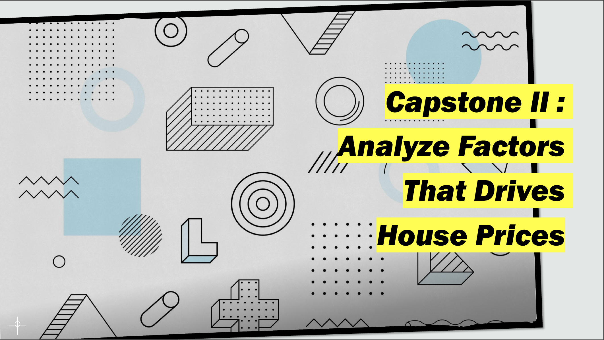

# About me

Hi, my name is Angel Mendoza, Data Analyst in San Francisco Bay Area. Data is more important now than ever and it is all around us, which is why as a data analyst I help transform data into a meaningful insight that could help others make data-driven decisions. 

# [World University Ranking - Statistical Analysis and comapring of means using T-test](https://github.com/gelmendozzza/world-university-ranking)
In this project, I did an analysis on World university ranking 2023 dataset by QS World University ranking wherein they feature the top 1400 university across the globe. 

Institutions were assessed across six categories(indicators) to effectively capture their performance. Base on QS World University Ranking, their main objective was to help students decide for their future.

The goal of this project is to analyze the correlation between employer reputation score and graduate employment rate score, run a T-test to measure statistical difference between US and other intitutions in terms of academic reputation and graduate employment rate score.

Tool: Python

# [Housing Price Driving Force - Statistical Analysis and Variables Affecting Price](https://github.com/gelmendozzza/Housing-Price-Driving-Force)
Analyzed and derived insights from the housing market dataset to identify variables that influences house prices
Conducted statistical analysis using T-test and Correlation analysis to determine the formulated hypothesis result
Presented results and recommendations based on findings of the statistical test

Tool: Microsoft Excel and powerpoint

# [Lariat Rental Company: Business Model Analysis and Growth Revenue Opportunity](https://github.com/gelmendozzza/Lariat-Car-Rental-Company)
Analyzed and derive insights from the rental fleet data to reach goal of minimizing cost and maximizing profit
Produced different strategies that could help the business attain its goal through analysis of their raw data from the previous years 
Presented insight and findings using Microsoft Excel and Powerpoint.

